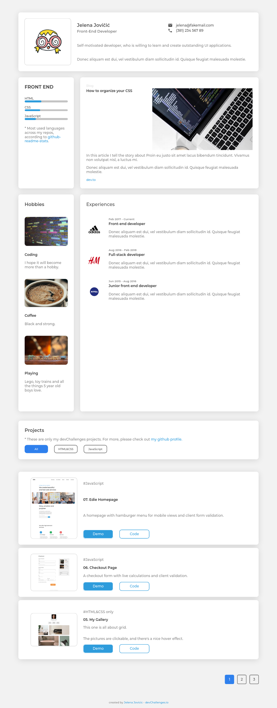

# README - devChallenges.io Portfolio

<h1 align="center">devChallenges.io Portfolio</h1>

   Solution for a challenge from  <a href="http://devchallenges.io" target="_blank">Devchallenges.io</a>.

  <h3>
    <a href="https://je-jo-devchallenges-portfolio.netlify.app/">
      Demo
    </a>
     | 
    <a href="https://github.com/je-jo/devchallenges-portfolio">
      Solution
    </a>
     | 
    <a href="https://devchallenges.io/challenges/5ZnOYsSXM24JWnCsNFlt">
      Challenge
    </a>
  </h3>

## Table of contents

- [Overview](#overview)
  - [Description](#description)
  - [Screenshot](#screenshot)
  - [Links](#links)
- [The process](#the-process)
  - [Built with](#built-with)
  - [Observations](#observations)
  - [Useful resources](#useful-resources)
- [Author](#author)

## Overview

### Description

A final project for devChallenges.io. Not actual portfolio.

This site was created as a submission to a [DevChallenges](https://devchallenges.io/challenges) challenge. The [challenge](https://devchallenges.io/challenges/5ZnOYsSXM24JWnCsNFlt) was to build an application to complete the given user stories:

- [x] User story: I can see personal details
- [x] User story: I can see skills
- [x] User story: I can see projects
- [ ] User story: I can filter projects by tag
- [x] User story: I can see hobbies or certificates
- [x] User story (optional): I can see experiences
- [x] User story (optional): I can see blogs
- [x] User story (optional): I can see projects on different pages

### Screenshot

### Links

- [Repo](https://github.com/je-jo/devchallenges-portfolio)
- [Live Site](https://je-jo-devchallenges-portfolio.netlify.app/)

## My process

### Built with

- Semantic HTML5 markup
- CSS custom properties
- CSS Grid
- Flexbox
- Mobile-first workflow
- Javascript

### Observations

- Tried to make responsive page without using media queries, but there is still one media query - when the viewport gets big enough to have 3 grid columns, make certain grid items span 2 rows, but not before that. Any ideas to do this without a media query are appreciated.

- First time using Netlify for deployment. It's nice but sticking with github pages for now.

### Useful resources

- [My Basic Template](https://github.com/je-jo/basic-template) pretty much based on Stephanie Eckless' [HTML / Sass Jumpstart](https://github.com/5t3ph/html-sass-jumpstart) but much simpler;
- [grid-column-end](https://css-tricks.com/almanac/properties/g/grid-column-end/) - css-tricks almanac, helped with grid items placement;
- [Pexels](https://www.pexels.com/) - Images by: ABDUL KAYUM, samer daboul, Magda Ehlers.
- [Material Design Icons](https://google.github.io/material-design-icons/)
- [How to Implement Pagination with Vanilla JavaScript](https://webdesign.tutsplus.com/tutorials/pagination-with-vanilla-javascript--cms-41896)

## Author

- [Github](https://github.com/je-jo)
- [Frontend Mentor](https://www.frontendmentor.io/profile/je-jo)
- [Codepen](https://codepen.io/je-jo)
- [Twitter](https://twitter.com/jelena_jo_)